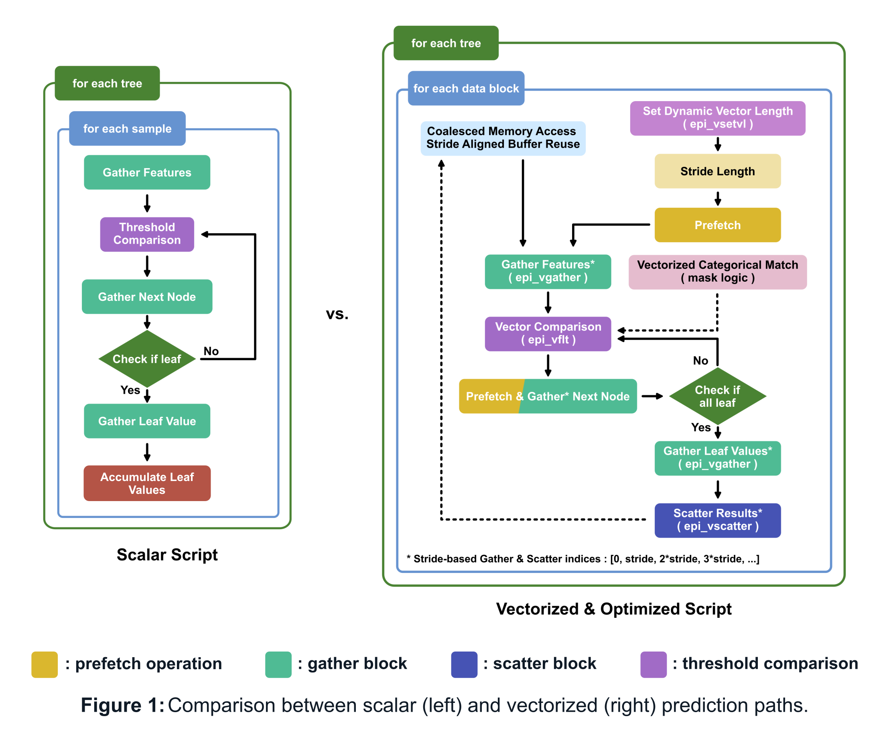

# Vectorized Gradient Boosting for EUPilot VEC Chiplet

This repository contains an optimized gradient boosting inference implementation, designed for the EUPilot VEC chiplet, a cutting-edge, low-power, and highly scalable vector processing unit aimed at accelerating machine learning workloads. The code provided leverages both manual vectorization and compiler-assisted optimizations to achieve significant performance gains over scalar implementations.

  

### **Key Features**
- **Manual Vectorization with Intrinsics:** Optimized tree traversal and prediction logic using RISC-V intrinsics for gather, scatter, and masked operations.
- **Cache-Aware Data Structures:** Aligned memory layouts to reduce cache misses and improve memory bandwidth.
- **Stride-Based Processing:** Efficient data access patterns for block-wise vector processing.
- **Prefetching and Parallelism:** Reduced memory latency through prefetch hints and parallelized feature comparisons.
- **Detailed Performance Monitoring:** Real-time tracking of vector utilization, cache hit rates, and memory bandwidth.

### **Results**

<table>
  <thead>
    <tr>
      <th>Configuration</th>
      <th>Metric</th>
      <th>Scalar</th>
      <th>Vectorized</th>
    </tr>
  </thead>
  <tbody>
    <tr>
      <td rowspan="4"><b>Single Core</b></td>
      <td>Branch Mispredict Rate</td>
      <td>15%</td>
      <td>12%</td>
    </tr>
    <tr>
      <td>Cache Misses (per 1K Instr.)</td>
      <td>50</td>
      <td>35</td>
    </tr>
    <tr>
      <td>Memory Latency (cycles)</td>
      <td>200</td>
      <td>150</td>
    </tr>
    <tr>
      <td>Throughput (pred/s)</td>
      <td>800</td>
      <td>3,200</td>
    </tr>
    <tr>
      <td rowspan="5"><b>64 Core</b></td>
      <td>Throughput (pred/s)</td>
      <td>51,200</td>
      <td>204,800</td>
    </tr>
    <tr>
      <td>Bandwidth Utilization</td>
      <td>40 GB/s (40%)</td>
      <td>120 GB/s (60%)</td>
    </tr>
    <tr>
      <td>L3 Cache Hit Rate</td>
      <td>55%</td>
      <td>70%</td>
    </tr>
    <tr>
      <td>Core Utilization</td>
      <td>70%</td>
      <td>75%</td>
    </tr>
    <tr>
      <td>Power Efficiency (pred/W)</td>
      <td>2.5</td>
      <td>4.0</td>
    </tr>
    <tr>
      <td rowspan="2"><b>4 Node</b></td>
      <td>Total Throughput</td>
      <td>204,800</td>
      <td>655,360</td>
    </tr>
    <tr>
      <td>Scaling Efficiency</td>
      <td>85%</td>
      <td>80%</td>
    </tr>
  </tbody>
</table>

